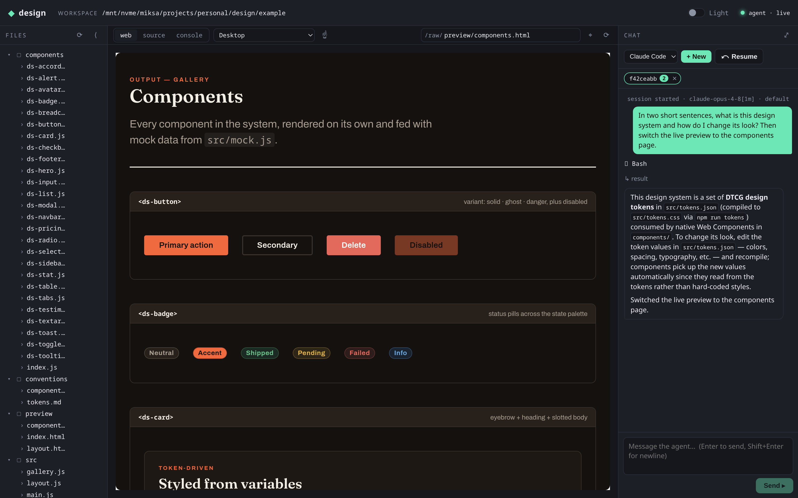
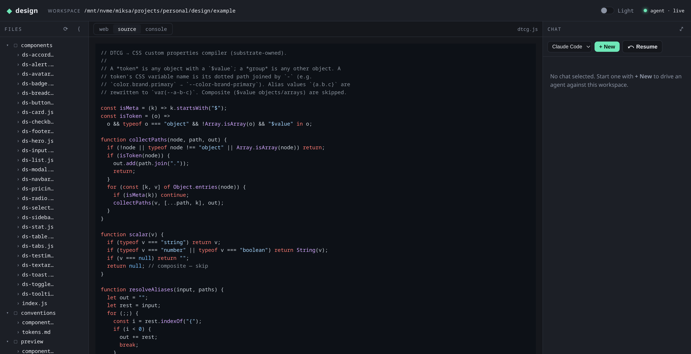
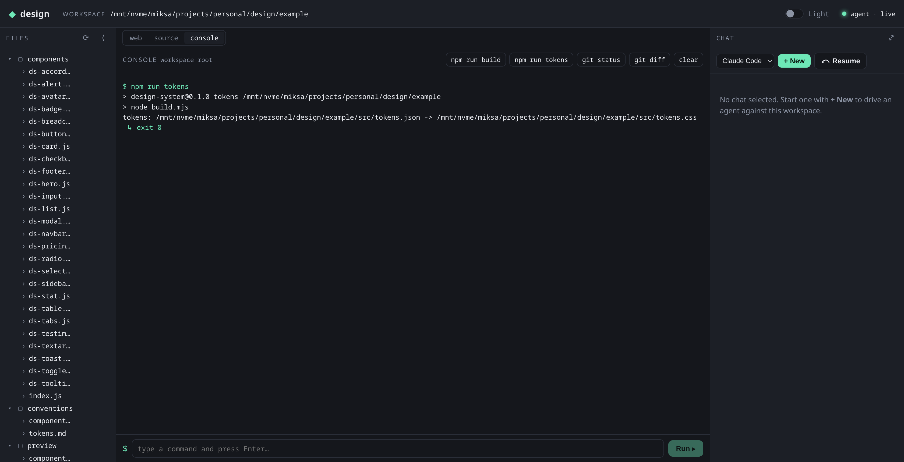

# design

A locally-run CLI that serves a small web app for driving a code agent against a
**git-controlled, agent-neutral design-system repo**.

```sh
design ./my-design-system
```

You open the printed `http://127.0.0.1:…` URL, chat with an agent that edits the
workspace, run shell commands, browse files, and watch a live preview — all
against a repo that stays workable without the tool.

## Screenshots

Driving an agent against the sample design system: the chat edits the workspace
and flips the live preview to the components page, all in one loop.



<table>
<tr>
<td width="50%">

**Source view** — any workspace file, syntax highlighted.



</td>
<td width="50%">

**Console** — `bash -lc` in the workspace, streamed live.



</td>
</tr>
</table>

## The idea

The shareable artifact is the **repo**, not the tool. `design` is a disposable,
dev-server-class driver. The core invariant: the repo stays workable by anyone —
any agent, any LLM, or by hand — so the tool is always a convenience, never a
dependency.

To keep that promise, **the tool is folder-agnostic**: it imposes no substrate
format and runs no substrate build. It points at any directory, serves its
files, and brokers prompts to an agent. `example/` is just one sample design
system (DTCG token JSON + native Web Components) — a suggestion, not a contract.

## Status

The CLI, the localhost server, the driver SPA, and the agent connection are all
in place. Only the git-diff review view remains.

- ✅ `design <folder>` — loopback-only server, random port, per-launch token,
  Host + Origin checks
- ✅ Driver SPA (Vue) embedded into the binary, top-tabbed:
  **Chat**, **Console**, **File browser**, **File preview** (syntax
  highlighted), and **Live preview** (an iframe with an editable address)
- ✅ File APIs: workspace tree, file read (path-traversal safe), raw file serving
- ✅ **Agent connection** — a session manager owns long-lived agent processes
  keyed by UUID, multiplexed over `/ws`; closing the browser detaches (the agent
  keeps running), and the Vue chat speaks Claude Code stream-json and answers
  permission prompts
- ✅ **Console** — runs `bash -lc <command>` in the workspace, streamed over the
  same socket
- ⏳ Git diff / keep-discard review of agent changes (the "Changes" view)

## Architecture

Two separable concerns:

- **The tool** — a single Rust crate: a loopback-only Axum server that serves the
  embedded SPA, the workspace files, and a WebSocket that brokers agent sessions
  and console commands. Disposable; it never touches the substrate's build.
- **The substrate** — the design-system repo being edited. Whatever the user's
  folder is. It owns its own build (if any); the tool only reads and serves it.
  `example/` is a working sample (Web Components themed by DTCG tokens, compiled
  with `npm run tokens`), but nothing in the tool assumes that shape.

The backend is a **pure byte relay**: it owns agent process lifecycles but never
parses stream-json. The SPA owns the protocol.

## Repo layout

```
src/                # the tool (single crate, logic in the library)
  bin/design.rs     # CLI entry (positional workspace folder + --allow rules)
  lib.rs            # library root
  server.rs         # Axum: security, file APIs, /ws, static serving
  agent.rs          # session manager: long-lived agent processes keyed by UUID
  console.rs        # bash command runner streamed over /ws
  embed.rs          # rust-embed of the built SPA (ui/dist)
ui/                 # Vue 3 + Vite driver SPA (embedded into the binary)
  src/agent.js      # WS client
  src/Chat.vue      # stream-json parser + chat UI + permission prompts
  src/Console.vue   # console UI
example/            # sample substrate: Web Components + DTCG tokens
  dtcg.js           # DTCG → CSS compiler (substrate-owned)
  build.mjs         # zero-dep Node runner for it (`npm run tokens`)
  src/tokens.json   # design tokens (source of truth)
```

## Prerequisites

- Rust (stable) + Cargo
- Node + npm
- [Claude Code](https://claude.com/claude-code) CLI on `PATH` (for the agent chat)

## Build & run

The SPA is embedded into the binary at compile time, so it must be built
**before** `cargo build`. All flows go through the **`Makefile`**, which enforces
that ordering:

```sh
make run                 # build ui/dist + run the tool on ./example
make run FOLDER=./path   # …or against any folder
make build               # build the SPA, then the binary
make tokens              # (sample only) compile example/src/tokens.css
make verify              # lint + tests
make                     # list all targets
```

Open the printed URL. Ctrl-C stops the server cleanly. Run `nvm use` first if
needed (Node is pinned in `.nvmrc`).

By default the server binds a random free loopback port. Pin one with `-p`:

```sh
./target/debug/design ./example -p 4321
```

### Agent permissions

Spawned agents run with `--permission-mode default` and a pre-approved tool set.
The default allowlist covers read-only inspection plus edits and the common
build/VCS-status commands a design loop needs; anything else prompts in the chat.
Override it with repeatable `--allow` rules (passed through to Claude Code's
`--allowedTools`):

```sh
design ./my-design-system --allow Read --allow Edit --allow "Bash(npm *)"
```

### Claude Code binary

Agents launch the `claude` binary found on your `PATH`. If yours lives elsewhere
— or under a different name — point the tool at it with `DESIGN_CLAUDE_BIN`
(a path or bare command name; also honoured from `.env`):

```sh
DESIGN_CLAUDE_BIN=/opt/claude/bin/claude design ./my-design-system
```

## Security model

The server is the only new attack surface, so it ships locked down from day one:

- Binds `127.0.0.1` only by default (never `0.0.0.0` unless you ask for it).
- A random per-launch token authorizes the first navigation via `?t=…`, then
  pins to a `Strict`, `HttpOnly` cookie for the session.
- `Host` and `Origin` headers are validated against the loopback authority to
  block DNS-rebinding and cross-site requests.
- File reads are confined to the workspace root (path-traversal rejected).
- `/ws` and the agent/console routes sit behind the same middleware — nothing
  bypasses the token + Host/Origin checks.

### Exposing to your network (`--public`)

`--public` binds `0.0.0.0` so other machines can reach the server — useful for
driving the agent from a phone or another box. The token still gates every
request, and the cross-site guard tightens to **same-origin** (the `Origin`, when
present, must match the request's own `Host`) since the client address can't be
known in advance. Only the fixed loopback Host allowlist is relaxed. Treat the
token URL as a secret: anyone who can reach the host and has it can drive the
agent.

```sh
design ./my-design-system --public -p 4321
```

## Releases

Pushing a version tag triggers the `release` workflow
([`.github/workflows/release.yml`](.github/workflows/release.yml)): it runs the
tests, then cross-builds native binaries for Linux, macOS (Intel + Apple
Silicon), and Windows and attaches them to a GitHub Release for the tag.

Tags — and the version baked into the binary — use a **`YYYY.mm.dd[.a-z]`**
date scheme (zero-padded month/day, optional `.a`–`.z` suffix to disambiguate
multiple releases on the same day), e.g. `2026.06.10` or `2026.06.10.b`. The
format is enforced by the workflow and unit-tested in `src/version.rs`.

```sh
git tag 2026.06.10 && git push origin 2026.06.10
```

Each build stamps the version, git commit, and UTC build time into the binary
(via `build.rs`), surfaced through `design --version`:

```text
design 2026.06.10 (a1b2c3d, built 2026-06-10T12:34:56Z)
```

## License

MIT.
